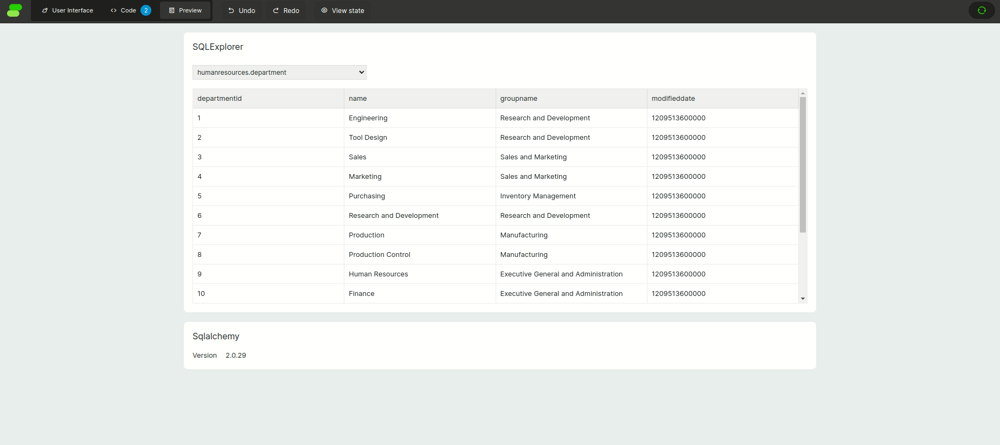
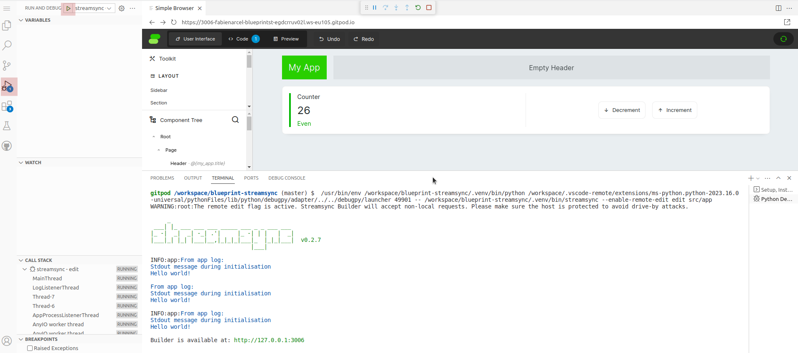

## streamsync - sqlexplorer

[](https://github.com/FabienArcellier/spike-streamsync-sqlexplorer/actions/workflows/main.yml)

This prototype uses streamsync to explore a SQL database using SQL Alchemy. 
This example is using the [Workadventures database](https://github.com/morenoh149/postgresDBSamples).




## Getting started

### Run in gitpod

[gitpod](https://www.gitpod.io/) can be used as an IDE. You can load the code inside to try the code.

[](https://gitpod.io/#https://github.com/FabienArcellier/spike-streamsync-sqlexplorer)



### Run in local

1. start the database in a terminal

You must start a terminal dedicated to the database. In this terminal you will play the command `poetry run alfred run.db`


2. mount the data into the database

In a second terminal, you mount the data with the command `poetry run alfred run.db.init`

2. run the streamsync application

In this second terminal, you will start streamsync with the command `poetry run alfred run`

## The latest version

You can find the latest version to ...

```bash
git clone https://github.com/FabienArcellier/spike-streamsync-sqlexplorer.git
```

## Contributors

* Fabien Arcellier

## License

MIT License

Copyright (c) 2018-2024 Fabien Arcellier

Permission is hereby granted, free of charge, to any person obtaining a copy
of this software and associated documentation files (the "Software"), to deal
in the Software without restriction, including without limitation the rights
to use, copy, modify, merge, publish, distribute, sublicense, and/or sell
copies of the Software, and to permit persons to whom the Software is
furnished to do so, subject to the following conditions:

The above copyright notice and this permission notice shall be included in all
copies or substantial portions of the Software.

THE SOFTWARE IS PROVIDED "AS IS", WITHOUT WARRANTY OF ANY KIND, EXPRESS OR
IMPLIED, INCLUDING BUT NOT LIMITED TO THE WARRANTIES OF MERCHANTABILITY,
FITNESS FOR A PARTICULAR PURPOSE AND NONINFRINGEMENT. IN NO EVENT SHALL THE
AUTHORS OR COPYRIGHT HOLDERS BE LIABLE FOR ANY CLAIM, DAMAGES OR OTHER
LIABILITY, WHETHER IN AN ACTION OF CONTRACT, TORT OR OTHERWISE, ARISING FROM,
OUT OF OR IN CONNECTION WITH THE SOFTWARE OR THE USE OR OTHER DEALINGS IN THE
SOFTWARE.
